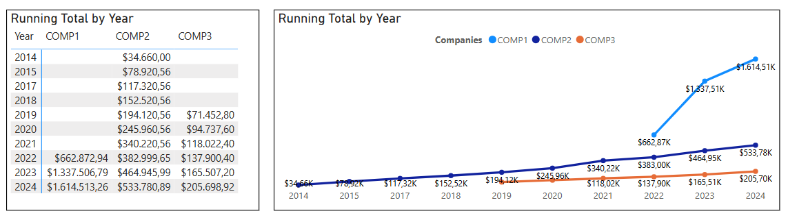

# Valor Total de Compras Acumulado por Fornecedor

## Objetivo do exercício
Criar uma medida DAX no Power BI para calcular o valor total acumulado de compras ao longo do tempo, segmentado por fornecedor. Esse tipo de métrica é essencial para acompanhar a evolução das compras e identificar padrões de crescimento.

## Conceitos Utilizados
- Funções de Agregação: SUM
- Funções de Contexto: CALCULATE, FILTER
- Manipulação de Hierarquia de Datas: ALLSELECTED
- Preservação do Contexto de Filtro: MAX

## Código DAX
```
Running Total Company = 
CALCULATE(
    SUM(PO[TOTALCOST]),
    FILTER(
        ALLSELECTED(PO[year_order]),
        PO[year_order] <= MAX(PO[year_order])
    )
)
```

## Explicação do Código
1. Soma dos valores totais de compra: SUM(PO[TOTALCOST]) agrega os valores de compra.
2. Filtro para Acumulado:
    1. FILTER(ALLSELECTED(PO[year_order]), PO[year_order] <= MAX(PO[year_order]))
    2. Isso garante que cada ponto da linha do gráfico represente a soma de todas as compras desde o início até aquela data.

## Resultados obtidos
- Um gráfico de linha mostrando a evolução das compras ao longo do tempo.
- Possibilidade de filtrar por fornecedor e visualizar o acumulado apenas para a empresa selecionada.
- Melhor entendimento do comportamento das compras ao longo do tempo.



## Insights
- Identificar períodos de maior volume de compras.
- Comparar fornecedores em termos de tendência de crescimento.
- Verificar picos sazonais ou padrões cíclicos.

## Conclusão
Essa métrica permite uma análise detalhada da evolução das compras por fornecedor ao longo do tempo. A utilização de ALLSELECTED(PO[year_order]) garante que o acumulado respeite os filtros aplicados no relatório, tornando a medida mais dinâmica e responsiva.
